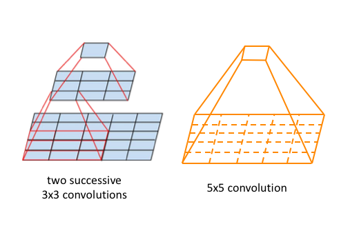

<div align="center">
    
</div>

<h2 align="center"> These are the solutions for the Session 1 assignment </h2>

---

## Question: 1. What are Channels and Kernels (according to EVA)?

To define channels and kernels, we should first know about features. 
A feature is nothing but an alphabet (building block) in the neural networks dictionary. For example, if we are building a simple NN to to detect english sentences (OCR), we would teach it english alphabets as once it learns those 26 letters it can form or detect any english sentence.
Continuing with this example if the model has to detect the work `"meow"` it should know the letter `"m"` which becomes a feature of for the NN.

Channel: A channel is sort of a collection of a single feature (similar characteristics). In our example, a channel for the feature `"m"`  will be a collection of `"m's"`. If we personify this channel then it will only see `"m"` of various sizes, shapes etc.(colors really doesn't matter because they don't provide much information. For example, if I see a capsicum 🫑, my brain will recognize it based on it's shape and structure whether it is a red 🫑 or yellow or green.).     


<div align="center">
     
<p>what a "m" channel will see </p>
</div>


Kernel: A kernel is actually an extractor (like a color picker 💉) mathematically, a function which extracts the features to form channels. Like a picker to pluck all the `"m"`'s in `"meow"`. 


## Question: 2. Why should we (nearly) always use 3x3 kernels?
There are various questions that comes into mind while actually thinking about why `3x3`. So let's break em down:

1. why `odd x odd` and not `even x even`?

    One and the most important argument to this is that `odd` numbers have a special symmetry associated with them. That means that they are similar on both the sides of the medians. This makes it possible to include pixels info on either sides of the anchor/source pixel.
    Whereas in an `even x even` shaped kernel, we are forced to include information on only one side of the source pixel i.e., either left or right. This leads to [aliasing error](https://arxiv.org/abs/2102.07757#:~:text=Aliasing%20is%20a%20well%2Dknown,from%20its%20low%2Dfrequency%20components.) while downsampling the image. Although one way of solving this is by applying low-pass filter, but it leads to degradation in performance. Hence, better to prevent it than cure it.

2. why `3 x 3` and not `5 x 5` or larger?

    The role of kernel is to take advantage of the spatial structure of input data. That is what the kernel does by considering the pixel and all his direct neighbors in the receptive field (3x3 receptive field).

    A 3x3 kernel is how the network "understand" that the input is a 2d image.

    A 1x1 kernel (not considering neighbors) will be much less efficient as each pixel will be computed separately, the network will not "understand" that input is a 2d image.

    A 5x5 kernel will take further neighbors into consideration, so it won't be very different than 3x3 in term of input structure understanding, but it will be much more costly (9 vs 25 parameters).However, in the recent [ConvNeXt paper](https://arxiv.org/pdf/2201.03545.pdf), 7x7 kernels are used to mimic the local self-attention mechanism in Vision Transformers. Here, increasing the kernel size slightly improved performance

    The philosophy of CNN (compare to dense layers) is to limit the number of parameters per layer and to have more layers.

    So it makes sense to say that 3x3 kernel is the king kernel with 2 important properties :
    - Lower per-layer complexity
    - Leverage 2d spatial structure

    Following GIF shows the convolution of 4x4 to 2x2.

    <div align="center">
     
    </div>

    Similarly we can convolve a 3x3 to 5x5.
    
    <div align="center">
     
    </div>


## Question: 3. How many times to we need to perform 3x3 convolutions operations to reach close to 1x1 from 199x199 (type each layer output like 199x199 > 197x197...)

```
layers = [f"{size} x {size} -> " for size in range(199, 0 , -2)]
print(*layers)

```

Outputs:

```
>>> print(*layers)
199 x 199 ->  197 x 197 ->  195 x 195 ->  193 x 193 ->  191 x 191 ->  189 x 189 ->  187 x 187 ->  185 x 185 ->  183 x 183 ->  181 x 181 ->  179 x 179 ->  177 x 177 ->  175 x 175 ->  173 x 173 ->  171 x 171 ->  169 x 169 ->  167 x 167 ->  165 x 165 ->  163 x 163 ->  161 x 161 ->  159 x 159 ->  157 x 157 ->  155 x 155 ->  153 x 153 ->  151 x 151 ->  149 x 149 ->  147 x 147 ->  145 x 145 ->  143 x 143 ->  141 x 141 ->  139 x 139 ->  137 x 137 ->  135 x 135 ->  133 x 133 ->  131 x 131 ->  129 x 129 ->  127 x 127 ->  125 x 125 ->  123 x 123 ->  121 x 121 ->  119 x 119 ->  117 x 117 ->  115 x 115 ->  113 x 113 ->  111 x 111 ->  109 x 109 ->  107 x 107 ->  105 x 105 ->  103 x 103 ->  101 x 101 ->  99 x 99 ->  97 x 97 ->  95 x 95 ->  93 x 93 ->  91 x 91 ->  89 x 89 ->  87 x 87 ->  85 x 85 ->  83 x 83 ->  81 x 81 ->  79 x 79 ->  77 x 77 ->  75 x 75 ->  73 x 73 ->  71 x 71 ->  69 x 69 ->  67 x 67 ->  65 x 65 ->  63 x 63 ->  61 x 61 ->  59 x 59 ->  57 x 57 ->  55 x 55 ->  53 x 53 ->  51 x 51 ->  49 x 49 ->  47 x 47 ->  45 x 45 ->  43 x 43 ->  41 x 41 ->  39 x 39 ->  37 x 37 ->  35 x 35 ->  33 x 33 ->  31 x 31 ->  29 x 29 ->  27 x 27 ->  25 x 25 ->  23 x 23 ->  21 x 21 ->  19 x 19 ->  17 x 17 ->  15 x 15 ->  13 x 13 ->  11 x 11 ->  9 x 9 ->  7 x 7 ->  5 x 5 ->  3 x 3 ->  1 x 1
```

To print the length 

```
print(len(layers)-1)
```
Here len is the total number of layers, we do length - 1 because one convolution is needed to switch from one layer to another.

Outputs:
```
99
```

## Question: 4. How are kernels initialized? 

Kernels are composed of weights and mainly three problems arise in the initialization of these weights:

1. Zero Initialization — Symmetry Problem

    This happens when initialized weights of a neural network are all zero and results in the neural network becoming a linear model.

Part of the reason why a neural network is good at unpickling complex patterns in data is due to its non-linearity. By setting all the weights to the same value at zero, all the partial derivatives in backpropagation will be the same for every neuron. While this won’t break the algorithm, this will stall any learning as all the neurons in the same layer will have the same weight in an iteration i.e. all the neurons will be learning the same parameter. If a linear neural network serves your problem well, it is probably overkilling in terms of memory and computational resources. You should opt for a linear regression instead. On the other hand, if the underlying problem is not of linear nature, then a linear neural network is not robust or accurate enough.

Prevention:

    - Just avoid initializing all weights to zero


2. Too-small Initialization — Vanishing Gradient

This happens when initialized weights of a neural network are too small and results in premature convergence.

Symptoms: 
Model performance improves very slowly during training. The training process is also likely to stop very early.

If the initial weights of a neuron are too small relative to the inputs, the gradient of the hidden layers will diminish exponentially as we propagate backward. Or you may also say, vanishing through the layers. 

Prevention:

    - LSTM can solve the vanishing gradient problem with its gates
    Use activation function like ReLu or leaky ReLu which are both less prone to vanishing gradient
    - Reduce the number of layers
    - Randomly initialize weights at a sufficiently large expected value

3. Too-large Initialization — Exploding Gradient

It happens when initialized weights of the neural network are too large and results into the loss value oscillation around minima and non convergence.

Symptoms: The model will have large changes in its loss value on each update due to its instability. Loss values may also reach NaN.

Prevention:
- Gradient clipping which limits the size of the gradient
- Use activation function like ReLu or leaky ReLu which are both less prone to exploding gradient
- Randomly initialize weights with sufficiently small expected values
- Reduce the number of layers

Ensuring zero-mean and maintaining the value of the variance of the input of every layer guarantees no exploding/vanishing signal. This method applies both to the forward propagation (for activations) and backward propagation (for gradients of the cost with respect to activations).

4. Symmetry Breaking problem:

Happens when all the weights are initialized with equal values. 
The equality carries through the gradients associated with these weights and hence resulting into equal weights throughout the training process.

Prevention:
 - don't initialize the model with equal weights.


## Question 5. What happens during the training of a DNN?

DNN is similar to training a simple neural network in various ways.

It contains convolution layers along with pooling layers which are connected to the output layer. The similarity arises in forward propagation (where we pass the output of previous layers to next layers to adjust their weights) and back propagation (where we pass the final predicted output back to the network to minimize the loss, hence maximizing the probability of the output being as close to the actual output as possible.).

In the following image, we see different layers performing different tasks such as edges (layer 1), textures from edges (layer 2), patterns from textures(layer 3), parts from patterns(layer 4) and finally objects from parts(layer 5).

<div align="center">
    
</div>


## References:
1. [A ConvNet for the 2020s](https://arxiv.org/pdf/2201.03545.pdf)
2. https://towardsdatascience.com/3-common-problems-with-neural-network-initialisation-5e6cacfcd8e6
3. https://brilliant.org/wiki/backpropagation/#:~:text=Backpropagation%2C%20short%20for%20%22backward%20propagation,to%20the%20neural%20network's%20weights.